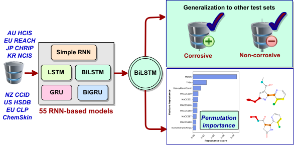

 # Comparative Analysis of Recurrent Neural Networks with Conjoint Fingerprints for Skin Corrosion Prediction

#### Huynh Anh Duy*, Tarapong Srisongkram** 

*Graduate School in the Program of Research and Development in Pharmaceuticals, Pharmaceutical Sciences, Faculty of Pharmaceutical Sciences, Khon Kaen University, Thailand. (huynhanhduy.h@kkumail.com; haduy@ctu.edu.vn)

**Division of Pharmaceutical Chemistry, Faculty of Pharmaceutical Sciences, Khon Kaen University, Thailand. (tarasri@kku.ac.th)

The full paper has been published in the **Journal of Chemical Information and Modeling (T1 and Q1 Scopus)**, a journal of the **American Chemical Society**.

The Article is available free of charge at: https://pubs.acs.org/doi/10.1021/acs.jcim.4c02062

#### MIT License

Copyright (c) [2025] [Dr.Tarapong Srisongram]

Permission is hereby granted, free of charge, to any person obtaining a copy of this software and associated documentation files (the "Software"), to deal in the Software without restriction, including the rights to use, copy, modify, merge, publish, distribute, sublicense, and/or sell copies of the Software, and to permit persons to whom the Software is furnished to do so, subject to the following conditions:

The above copyright notice and this permission notice shall be included in all copies or substantial portions of the Software.

THE SOFTWARE IS PROVIDED "AS IS", WITHOUT WARRANTY OF ANY KIND, EXPRESS OR IMPLIED, INCLUDING BUT NOT LIMITED TO THE WARRANTIES OF MERCHANTABILITY, FITNESS FOR A PARTICULAR PURPOSE AND NONINFRINGEMENT. IN NO EVENT SHALL THE AUTHORS OR COPYRIGHT HOLDERS BE LIABLE FOR ANY CLAIM, DAMAGES OR OTHER LIABILITY, WHETHER IN AN ACTION OF CONTRACT, TORT OR OTHERWISE, ARISING FROM, OUT OF OR IN CONNECTION WITH THE SOFTWARE OR THE USE OR OTHER DEALINGS IN THE SOFTWARE.
